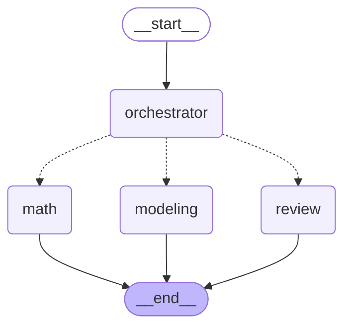

```mermaid
graph TD;
        __start__([<p>__start__</p>]):::first
        orchestrator(orchestrator)
        modeling(modeling)
        math(math)
        review(review)
        __end__([<p>__end__</p>]):::last
        __start__ --> orchestrator;
        orchestrator -.-> math;
        orchestrator -.-> modeling;
        orchestrator -.-> review;
        math --> __end__;
        modeling --> __end__;
        review --> __end__;
        classDef default fill:#f2f0ff,line-height:1.2
        classDef first fill-opacity:0
        classDef last fill:#bfb6fc
```
